# TradeSight Operational Playbook

This guide outlines your day-to-day routine to operate the TradeSight Platform efficiently.

```mermaid
gantt
    title Day-to-Day TradeSight Timeline
    dateFormat  HH:mm
    axisFormat %H:%M
    
    section Setup & Open
    Start TWS & Check API       :active, 09:00, 09:30
    Launch Web Dashboard        :active, 09:15, 09:30
    Start Paper Trader Loop     :active, 09:25, 09:30
    
    section Active Trading (Market Hours)
    Automated Scans & Executions: 09:30, 16:00
    Dashboard Visual Monitoring : 09:30, 16:00
    
    section Post-Market & Overnight
    Run Strategy Optimization   : 18:00, 23:00
```



---

## ⚙️ Core Components

1. **Interactive Brokers (TWS)**: The market data provider and trade executor. **Must be running** for live execution.
2. **Web Dashboard**: Visual interface for positions, statistics, and system health status.
3. **Paper Trader**: The automated loop that scans stocks, checks strategies, and issues orders.
4. **Overnight Evolution**: The machine learning optimizer that improves strategy parameters while you sleep.

---

## 🌅 Morning Routine (Before 9:30 AM EST)

Follow these steps to prepare your system for the trading day:

### Step 1: Start TWS (Trader Workstation)
1. Launch the TWS application on your Mac and sign into your Paper Trading account.
2. Verify API connections are enabled:
   * Go to **Edit** (or **TWS**) → **Global Configuration** → **API** → **Settings**.
   * Verify **"Enable ActiveX and Socket Clients"** is checked.
   * Verify **Socket port** matches `7497`.

### Step 2: Start the Web Dashboard
Open your terminal and run:
```bash
cd "/Users/bhargavpatel/Projects/Trade/tradesight"
python3 START_TRADESIGHT.py
```
* **URL**: [http://localhost:5001](http://localhost:5001) (or port `5000` based on settings)
* Keep this terminal window open.

### Step 3: Launch the Continuous Paper Trader Loop
In a separate terminal window, run the loop launcher script:
```bash
cd "/Users/bhargavpatel/Projects/Trade/tradesight"
python3 START_PAPER_TRADER.py
```

> [!TIP]
> **Automatic Virtual Environment Redirect:** You do not need to manually activate the virtual environment (`source .venv/bin/activate`) before running the scripts. Both `START_TRADESIGHT.py` and `START_PAPER_TRADER.py` automatically detect if they are run under the system python, and will instantly re-execute their processes inside the `.venv` context.


---

## 📈 Market Hours (9:30 AM – 4:00 PM EST)

Once the morning setup is complete, the system runs automatically:
* **The Paper Trader** connects to TWS via `clientId=1`. Every 5 minutes, it fetches historical daily bars, processes technical indicators (RSI, Bollinger Bands, MACD), checks your strategy configurations, and automatically submits paper trades to TWS.
* **The Dashboard** runs on `clientId=2`. Open [http://localhost:5001](http://localhost:5001) in your browser to monitor:
  * Open positions, entry prices, and current unrealized P&L.
  * Active strategy configurations and indicator health checks.

> [!TIP]
> Keep the Dashboard open on a secondary screen. It doesn't interfere with the trading execution since they now share a thread-safe singleton connection.

---

## 🌌 Evening Routine (After 4:00 PM EST Close)

After the market closes, you optimize your strategies using real data from the day:

### Run Overnight Strategy Evolution
This optimization script reviews the latest tournament statistics, runs walk-forward validations on historical data, and calculates optimal parameters (Stop Loss, Take Profit, and indicators) for the next trading session:
```bash
cd "/Users/bhargavpatel/Projects/Trade/tradesight"
.venv/bin/python scripts/overnight_strategy_evolution.py
```

> [!NOTE]
> You can automate this step by adding it to your system crontab to run at 6:00 PM (18:00) every weekday:
> `0 18 * * 1-5 cd /Users/bhargavpatel/Projects/Trade/tradesight && .venv/bin/python scripts/overnight_strategy_evolution.py >> logs/overnight.log 2>&1`

---

## 🚨 Emergency Operations

If something goes wrong (e.g., connection drop, unexpected market event, or synchronization lag), the Dashboard includes emergency controls:

### Emergency Close All
If you need to close all active positions immediately:
* Open [http://localhost:5001](http://localhost:5001)
* Navigate to the emergency tools section or trigger POST to `/api/emergency/close-all-positions`.
* This commands TWS to exit all equity positions and updates the local SQLite database state.

### Emergency Restore
If your local database drops out of sync with actual positions held in TWS:
* Trigger POST to `/api/emergency/restore-positions`.
* This fetches what you actually hold in TWS and updates the database to prevent untracked positions.
