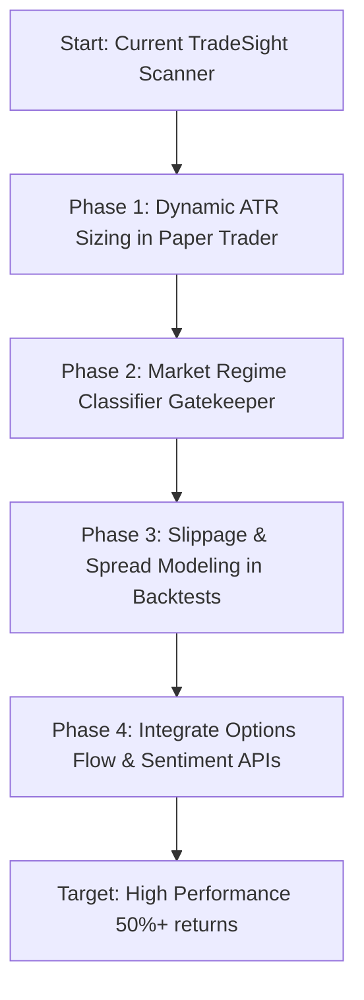

# 🎯 TradeSight Alpha Enhancements: Roadmap to 50%+ Returns

This document outlines the strategic architectural upgrades and enhancements to improve the return profile of the TradeSight algorithmic trading system. It serves as a blueprint for brainstorming sessions, prototyping, and future development sprints.

---

## 💡 Executive Summary
Achieving a 50%+ return in live trading requires moving away from static, single-indicator rules. Professional trading systems achieve high performance by focusing on **risk management**, **market regime classification**, and **alternative datasets**. 

Below are the 5 core enhancements designed to increase trading edge and returns.

---

## 🛠️ Core Enhancement Pillars

### 1. Risk-Parity & Dynamic Position Sizing
* **Objective**: Replace fixed stock quantities with risk-adjusted sizing to maximize capital efficiency and limit downside.
* **Mechanism**:
  * Calculate **Average True Range (ATR)** over 14 periods to measure the volatility of each target ticker.
  * Define a standard portfolio risk limit per trade (e.g., **1% of equity**).
  * Calculate the target quantity as:
    $$\text{Quantity} = \frac{\text{Portfolio Equity} \times \text{Risk Limit}}{\text{ATR} \times \text{Multiplier}}$$
  * Integrate the **Kelly Criterion** to scale up position sizes during high-confidence confluences and scale down during periods of consecutive losses.
* **Code Changes**:
  * [run_paper_trader.py](file:///Users/bhargavpatel/Projects/Trade/tradesight/scripts/run_paper_trader.py)
  * [stock_opportunities.py](file:///Users/bhargavpatel/Projects/Trade/tradesight/src/scanners/stock_opportunities.py)

### 2. Adaptive Market Regime Classifier
* **Objective**: Prevent strategy degradation by turning off indicators that perform poorly in mismatched market environments.
* **Mechanism**:
  * Classify the broader market indices (SPY, QQQ) into one of four states based on rolling volatility and moving average slopes:
    1. **Bullish Low-Vol** (Enable Trend-Following / Breakout strategies)
    2. **Bearish High-Vol** (Toggle short-selling or exit to cash)
    3. **Range-bound Mean-Reverting** (Enable RSI & Bollinger Band reversion strategies)
    4. **High-Vol Breakout** (Enable momentum breakouts)
  * Implement the regime gatekeeper in [regime_detector.py](file:///Users/bhargavpatel/Projects/Trade/tradesight/src/indicators/regime_detector.py).
* **Code Changes**:
  * [overnight_strategy_evolution.py](file:///Users/bhargavpatel/Projects/Trade/tradesight/scripts/overnight_strategy_evolution.py)
  * [technical_indicators.py](file:///Users/bhargavpatel/Projects/Trade/tradesight/src/indicators/technical_indicators.py)

### 3. Alternative Data: Options Flow (UOA) & Sentiment
* **Objective**: Gain a lead-time advantage over historical price bars by tracking institutional options orders and real-time news sentiment.
* **Mechanism**:
  * **Unusual Options Activity (UOA)**: Integrate flow alerts for large block trades and sweeps (high call-to-put volume ratios, high premium trades relative to daily volume).
  * **Sentiment Analysis**: Ingest news headlines and earnings call transcripts using a local sentiment analyzer (e.g. VADER or a small local LLM) to construct an hourly sentiment multiplier.
* **Code Changes**:
  * [stock_scanner.py](file:///Users/bhargavpatel/Projects/Trade/tradesight/src/scanners/stock_scanner.py)

### 4. Cross-Asset Polymarket Correlation Engine
* **Objective**: Leverage Polymarket prediction trends (Fed rate cuts, inflation benchmarks, macroeconomic indicators) to execute trades on related liquid ETFs.
* **Mechanism**:
  * Monitor prediction probabilities on key macroeconomic events.
  * When a probability drifts far from what is currently priced in equity or bond markets, open a directional proxy position (e.g., buying long bond ETF TLT on a rising rate-cut probability).
* **Code Changes**:
  * [scanner.py](file:///Users/bhargavpatel/Projects/Trade/tradesight/src/scanner.py)
  * [stock_opportunities.py](file:///Users/bhargavpatel/Projects/Trade/tradesight/src/scanners/stock_opportunities.py)

### 5. Friction, Commissions & Slippage Modeling
* **Objective**: Filter out "phantom" strategies that look profitable in simulated backtests but lose money in live execution due to fees and spreads.
* **Mechanism**:
  * Apply a standard **slippage penalty** per share (e.g., half the average bid-ask spread or a fixed fee percentage).
  * Incorporate realistic transaction cost models based on Alpaca or IBKR fee schedules.
* **Code Changes**:
  * Backtesting suite (e.g. `run_portfolio_backtest.py`)

---

## 📈 Roadmap & Next Steps

